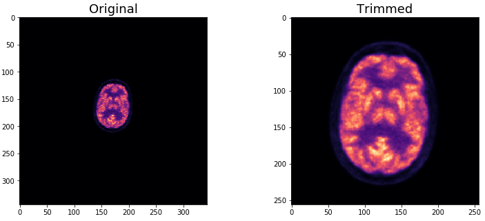
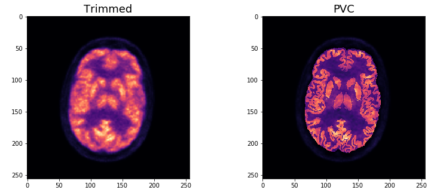

===============================
Partial volume correction (PVC)
===============================

Partial volume correction (PVC) improves the quality of the reconstructed PET images by correcting for the spill-over between different brain regions due to the limited spatial resolution :cite:`Markiewicz2018c`. *NiftyPET* implement the “iterative Yang” (iY) method :cite:`Yang1996, which is performed in the MRI domain, then it requires:

  (1) an anatomical T1 image, and 
  (2) a segmented version of the anatomical image in (1), e.g a the CSF, GM and WM, each of them labeled with a different number.
  
 Both images are automatically categorized by the function ``classify_input``:

 .. code-block:: python
  
  # automatically categorise the input data
  datain = nipet.classify_input(folderin, mMRpars)

resulting in:

  In [1]: datain
  Out[1]: 
  {'#mumapDCM': 192,
   'T1lbl': '/data/amyloid_brain/T1w_NeuroMorph_Parcellation.nii.gz',
   'T1nii': '/data/amyloid_brain/T1w.nii.gz',
   'corepath': '/data/amyloid_brain',
   'lm_bf': '/data/amyloid_brain/LM/17598013_1946_20150604155500.000000.bf',
   'lm_dcm': '/data/amyloid_brain/LM/17598013_1946_20150604155500.000000.dcm',
   'mumapDCM': '/data/amyloid_brain/umap',
   'nrm_bf': '/data/amyloid_brain/norm/17598013_1946_20150604082431.000000.bf',
   'nrm_dcm': '/data/amyloid_brain/norm/17598013_1946_20150604082431.000000.dcm'}

Trimming
--------

Prior to the PVC, it is recommended to trim and upsample the PET image(s). This can be activated by setting the option ``trim=True`` in the funtion ``mmrchain``.

.. code-block:: python

	recon = nipet.mmrchain(
                datain,
                mMRpars,
                frames = frmdef,
                mu_h = muhdct, 
                mu_o = muodct,
                itr = 4,
                fwhm = 0.,
                trim = True,
                outpath = opth,
                fcomment = '_dyn',
                store_img = True,
                store_img_intrmd = True)

In addition, the following options can be also set:

================  ==============
Argument          Description
================  ==============
``trim_scale``    the scaling factor for upsampling (greater than 1, by default 2)
``trim_interp``   interpolation order (0-nearest neighbour, 1-linear, as in scipy)
``trim_memlim``   set to True for cases when memory is limited, having a longer processing time 
================  ==============

This is a comparison between the original and the trimmed reconstructed image:

.. code-block:: python

  # axial index
  si = 100
  plt.subplot(1,2,1)
  plt.imshow(recon['im'][si/2,:,:], cmap='magma')
  plt.title('Original')
  plt.colorbar()
  plt.subplot(1,2,2)
  plt.imshow(recon['trimmed']['im'][si,:,:], cmap='magma')
  plt.title('Trimmed')
  plt.colorbar()

   Comparison between the reconstructed images with (left) and without trimming (right)

PVC
---

It is activated by setting the option ``pvcroi`` in the funtion ``mmrchain`` to a list of regions with number label which correspond to the image values of the segmented T1w image, e.g.:

.. code-block:: python

	pvcroi = [
            [1], # ROI 1 (single parcellation region)
            [2, 3], # ROI 2 (region consisting of multiple parcellation regions)
            ...
          ]
	recon = nipet.mmrchain( 
               datain,
               mMRpars,
               frames = frmdef,
               mu_h = muhdct, 
               mu_o = muodct,
               itr = 4,
               fwhm = 0.,
               trim = True,
               pvcroi=pvcroi,
               outpath = opth,
               fcomment = '_dyn',
               store_img = True,
               store_img_intrmd = True)

In addition, the following options can be also set:

================  ==============
Argument          Description
================  ==============
``pvcreg_tool``   co-registration tool.  By default it is NiftyReg, but SPM is also possible (needs `Matlab engine <https://www.mathworks.com/help/matlab/matlab-engine-for-python.html>`_ and more validation)
``store_rois``    stores the image of PVC ROIs as defined by pvcroi.
``psfkernel``     the point spread function (PSF) specific for the scanner and the object. For the Siemens Biograph scanner, it can be set to ``nimpa.psf_measured(scanner='mmr', scale=trim_scale)``
``pvcitr``        set to True in cases when memory is limited, having a longer processing time
================  ==============

This is a comparison between the trimmed and the PVC reconstructed image:

.. code-block:: python

  # axial index
  si = 100
  plt.subplot(1,2,1)
  plt.imshow(recon['trimmed']['im'][si,:,:], cmap='magma')
  plt.title('Trimmed')
  plt.colorbar()
  plt.subplot(1,2,2)
  plt.imshow(recon['impvc'][si,:,:], cmap='magma')
  plt.title('PVC')
  plt.colorbar()

   Comparison between the trimmed reconstructed images before (left) and after PVC (right)

